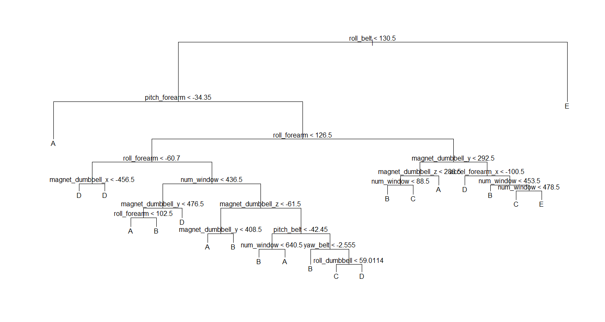

# Practical Machine Learning

**2015.7.24**

## Sypnosis

#### 1. Dataset

Today, with tracking devices, it is  possible to collect a large amount of data about personal activity relatively inexpensively. One thing that people regularly do is quantify how much of a particular activity they do, but they rarely quantify how well they do it. In this project, your goal will be to use data from accelerometers on the belt, forearm, arm, and dumbell of 6 participants. They were asked to perform barbell lifts correctly and incorrectly in 5 different ways. More information is available from the website [here](http://groupware.les.inf.puc-rio.br/har), see the section on the Weight Lifting Exercise Dataset. 

#### 2. Objective

The goal of this project is to predict the manner in which they did the exercise. This is the "classe" variable in the training set. You may use any of the other variables from the training dataset to predict the this outcome, and after training the model with the training dataset, you will that model to predict the "classe" of the testing dataset. The link to the training and testing dataset can be found in the R script in the next section.

#### 3. Overview

In this project, I will train a classification tree using both the rpart and tree package and determine which one is better by looking at their prediction accuracy ( I know random forest will definitely generate better results, but compared to other tree-models it takes a little bit too long, so I won't be using that )  


## I. Environment Setting and Loading Dataset 


```r
# load library
suppressMessages( suppressWarnings( library(tree ) ) )
suppressMessages( suppressWarnings( library(caret) ) )
suppressMessages( suppressWarnings( library(rpart) ) )
# set working directory
setwd("C:/Users/ASUS/machine-learning/Coursera")
# download the file into data folder
if( !file.exists("data") )
{
    dir.create("data")
    url1 <- "https://d396qusza40orc.cloudfront.net/predmachlearn/pml-training.csv"
    url2 <- "https://d396qusza40orc.cloudfront.net/predmachlearn/pml-testing.csv"
    link <- c( url1, url2 )
    file <- c( "data/training.csv", "data/testing.csv" )
    for( i in 1:length(link) )
        download.file( link[i], file[i] )
}    
# read in both training and testing files
dataset <- lapply( list.files( "data", full.names = TRUE ), read.csv, na.strings = c( "NA", "" ) )      
```

## II. Data Preprocessing 

Implement a quick cleaning process before using the predictors for training.

- `preproccessed` Exclude columns that consists of NA values and the first five column, which consists of the row number, username and timestamp ( assumed to be irrelevant with the outcome ) and that leaves us with 55 column as the predictor variables.


```r
# boolean : column that consists of NA values  
boolean <- which( apply( dataset[[1]], 2, function(x) {sum( is.na(x) )} ) != 0 )
# preprocess on both the testing and training data
preprocessed <- lapply( dataset, function(x) { x[ , -c( 1:5, boolean ) ] } )
# extract the preprocessed training data
training <- preprocessed[[2]]
dim(training)
```

```
## [1] 19622    55
```

## III. Model Training

Before using a regression tree method to train a model, we split the training dataset into two parts, where 75 percent of the data will be used to actually train the model, while the rest will be used to evaluate the accuracy, i.e. out of sample error.  

```r
set.seed(1234)
# split the training data into two parts
inTrain <- createDataPartition( training$classe, p = .75, list = FALSE )
train <- training[  inTrain, ]
test  <- training[ -inTrain, ]
```

After finishing all of those "preprocessing" steps, we'll begin by using the basic tree function to build the classification tree and use that model to predict the testing data that was partitioned from the training data. Then we'll also performing a cross validation on the tree-model to determing if it needs pruning. For the tree package, overfitting may be prevented by removing the split that contributes least to the deviance reduction of the model.


```r
# train the model
train_tree <- tree( classe ~., data = train )
# 10-Fold
cross_tree <- cv.tree( train_tree, K = 10 )
# evaluate the difference of the deviation
diff(cross_tree$dev)
```

```
##  [1] 2621.00892   67.31049  260.57595 1814.74081 1776.33689    0.00000
##  [7]   81.39082   68.06933   32.61093   85.67179 2328.58589 1754.59245
## [13]    0.00000 7234.30694 2932.96410 4571.58294
```

- **Note:** Looking at the difference between the deviance for each node-size, we will not perform any pruning to the model. (The deviance difference is still quite large for the biggest size, i.e. the first number that appeared in the output vector ).

The confusion matrix and the overall accuracy of the prediction is listed below.


```r
# use the model to predict the splitted test data 
result_tree <- predict( train_tree, newdata = test, type = "class" )
# print out partial results
matrix_tree <- confusionMatrix( test$classe, result_tree )
list( confusionMatrix = matrix_tree$table, modelAccuracy = matrix_tree$overall["Accuracy"] )
```

```
## $confusionMatrix
##           Reference
## Prediction    A    B    C    D    E
##          A 1179   80    6  125    5
##          B   96  599   42  181   31
##          C    5   40  675  129    6
##          D    8   78  168  538   12
##          E   39   95   57  198  512
## 
## $modelAccuracy
##  Accuracy 
## 0.7143148
```

- **Note:** The ovrall accuracy of this fast and simple model is approximately 70 percent, doing ok, let's see if we can do better with the rpart package. 

The following section  basically implments similar prodecures. Train a model using rpart, determine whether this model needs pruning and in the end, print out the confusion matrix and accuracy. For the rpart package, whether the model needs pruning or not can be determined by looking at the complexity parameter table, from the table you can then select a tree size that minimizes the cross-validated error ( the xerror column ).


```r
# specify method = class for classification tree, "anova" for regression
train_rpart <- rpart( classe ~., data = train, method = "class" )
# complexity parameter table
train_rpart$cptable
```

```
##            CP nsplit rel error    xerror        xstd
## 1  0.11535175      0 1.0000000 1.0000000 0.005195739
## 2  0.05987531      1 0.8846482 0.8854078 0.005549402
## 3  0.03835564      4 0.7050223 0.7885693 0.005711054
## 4  0.03446312      6 0.6283110 0.6065698 0.005708689
## 5  0.02990601      7 0.5938479 0.5796069 0.005674709
## 6  0.02425710      8 0.5639419 0.5478021 0.005623082
## 7  0.02231083     10 0.5154277 0.4836229 0.005479372
## 8  0.02050698     11 0.4931169 0.4597930 0.005411894
## 9  0.01955758     12 0.4726099 0.4487800 0.005378000
## 10 0.01898794     13 0.4530523 0.4202032 0.005281765
## 11 0.01433590     14 0.4340644 0.3983670 0.005199845
## 12 0.01319662     15 0.4197285 0.3766258 0.005110684
## 13 0.01163011     16 0.4065319 0.3631444 0.005051414
## 14 0.01120289     18 0.3832716 0.3494731 0.004988063
## 15 0.01101301     19 0.3720687 0.3415931 0.004950015
## 16 0.01000000     20 0.3610557 0.3284914 0.004884186
```

- **Note:** From the complexity parameter table, the cross-validated error is the smallest for the final row, and still shows sign of decrease. Therefore, no pruning procedure is taken for this rpart model.


```r
# pedict
result_rpart <- predict( train_rpart, newdata = test, type = "class" )
# print out confusion matrix and overall accuracy
matrix_rpart <- confusionMatrix( test$classe, result_rpart )
list( confusionMatrix = matrix_rpart$table, modelAccuracy = matrix_rpart$overall["Accuracy"] )
```

```
## $confusionMatrix
##           Reference
## Prediction    A    B    C    D    E
##          A 1234   58   10   75   18
##          B  171  584   60  101   33
##          C   33   53  686   57   26
##          D   65   65  111  520   43
##          E   51  104   75  102  569
## 
## $modelAccuracy
##  Accuracy 
## 0.7326672
```

**Conclustion:** For this dataset, after removing the predictors that contains lots of NA values and the ones that were assumed to be irrelevant to the outomce ( e.g. name, timestamp ), the model that was built by the rpart package seems to perform a little bit better than the one generated by the tree package.


## IV. Appendix

The appendix provides the visualization of the model that was built by the tree package and the rpart package.

- **Plot of the tree-model**

```r
plot(train_tree)
text(train_tree, digits = 2 )
```

 

- **Plot of the rpart-model**

```r
suppressWarnings( library(rpart.plot) )
rpart.plot(train_rpart)
```

 


