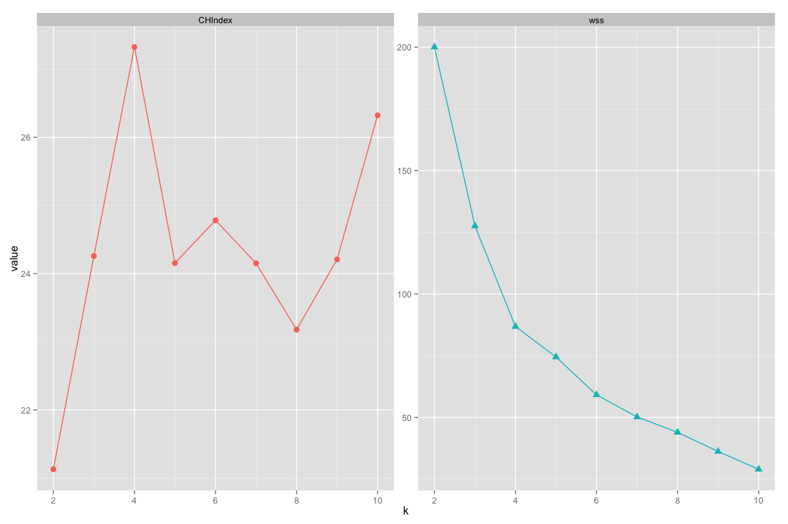

# Calinski-Harabasz Index and Boostrap Evaluation with K-means and Hierarchical Clustering
Ming-Yu Liu  
November 6, 2015  

## Background Information

When working with kmeans and hierarchichal clustering (this documentation assumes that you're familiar with these two algorithms), Calinski-Harabasz index and boostrap evaluation are two useful functions. The former is a kind of estimate that can help us chooses the proper clustering number before performing the algorithm. The later is used for evaulating the stability of the clustering result. 

> For this documentation we're dropping the issue on which variables should we include in the dataset. Note that, in practice this is an important preprocessing step before applying any sorts of algorithms.

## Preparing 

Here we use the built-in mtcars dataset as an example. Note that for clustering algorithms, units of the variables do matter. When the columns' units comes in different magnitudes ( e.g. weight is recorded in kilograms, height is recorded in centimeters ), a common approach to resolve this issue is to normalize the dataset. Here we use the `scale` function for doing this, which transforms all the variables to have a mean value of 0 and a standard deviation of 1.

```r
# source in the functions 
suppressMessages( source("/Users/ethen/machine-learning/clustering/clustering.R") )

# example dataset, 
# also remove the row.names or else will produce trivial warnings for later functions
mtcars_scaled <- scale(mtcars)
row.names(mtcars_scaled) <- NULL
head(mtcars_scaled)
```

```
##             mpg        cyl        disp         hp       drat           wt
## [1,]  0.1508848 -0.1049878 -0.57061982 -0.5350928  0.5675137 -0.610399567
## [2,]  0.1508848 -0.1049878 -0.57061982 -0.5350928  0.5675137 -0.349785269
## [3,]  0.4495434 -1.2248578 -0.99018209 -0.7830405  0.4739996 -0.917004624
## [4,]  0.2172534 -0.1049878  0.22009369 -0.5350928 -0.9661175 -0.002299538
## [5,] -0.2307345  1.0148821  1.04308123  0.4129422 -0.8351978  0.227654255
## [6,] -0.3302874 -0.1049878 -0.04616698 -0.6080186 -1.5646078  0.248094592
##            qsec         vs         am       gear       carb
## [1,] -0.7771651 -0.8680278  1.1899014  0.4235542  0.7352031
## [2,] -0.4637808 -0.8680278  1.1899014  0.4235542  0.7352031
## [3,]  0.4260068  1.1160357  1.1899014  0.4235542 -1.1221521
## [4,]  0.8904872  1.1160357 -0.8141431 -0.9318192 -1.1221521
## [5,] -0.4637808 -0.8680278 -0.8141431 -0.9318192 -0.5030337
## [6,]  1.3269868  1.1160357 -0.8141431 -0.9318192 -1.1221521
```

## Choosing the Right Clustering Number

We start off by using the hierarchical clustering method in R to cluster the scaled data, given that the dataset only contains 32 rows, we can use the dendogram to visualize clustering result, and from the plot below, clustering this dataset into four groups seems to be quite reasonable and straighforward.


```r
test <- hclust( dist(mtcars_scaled), method = "ward.D" )
plot(test)
rect.hclust( test, k = 4 )
```

 

Now what if we have let's say thousand rows of data or more, then the dendogram will probably be a blur and it probably won't be that useful in helping us choose the suitable cluster number (k) to group the data. Not to mention when you're working with kmeans where you have to specify the k before you run the algorithm.

So here we'll be using two measures, the Calinski-Harabasz Index, or known as the variance ratio criterion and Total within Sum of Squares for choosing the suitable k. Let's use the function and visualize both measures first, so it'll be easier to explain.

`CHCriterion` Function that calculates both measures for different values of k. Input parameters :     

- `data` Quite straightfoward, your dataset. data.frame or matrix type data will both work.
- `kmax` Maximum cluster number, caculates both measures from 2 cluster to kmax cluster (clustering the data into 1 cluster is the same as performing no clustering, therefore its measures are ommitted).   
- `clustermethod` Specify either "hclust" or "kmeanspp" for calculating the measures for heirarchichal or kmeans++ clustering. For those of you who are not famaliar with kmeans++, it is a simple algorithm built on top of kmeans so that it can generate a better k initial random center. You can refer to this [link](https://github.com/ethen8181/Mining-Massive-Dataset/blob/master/kmeans/kmeanspp.R) for some unformal explanation of how it works and the simple code to the algorithm. If it's still unclear then google is your best friend.
- `...` After specifying the "clustermethod", you can pass in other parameters into the R "hclust" and "kmeans" function. Please refer to the help page (?hclust or ?kmeans in R) for more information.
- The function returns a data frame of three columns, consisting of cluster number from 2 to kmax and its corresponding both measures' value, each in one column.


```r
# parameters : kmax = 10 ; clustermethod = "hclust"
# method = "ward.D" is one of parameters you can use to specify the
# the agglomeration method to be used for the hclust function in R
criteria <- CHCriterion( data = mtcars_scaled, kmax = 10, 
	                     clustermethod = "hclust", method = "ward.D" )
# result 
head(criteria)
```

```
##   k  CHIndex       wss
## 1 2 21.12828 200.08496
## 2 3 24.25839 127.57236
## 3 4 27.32530  86.81903
## 4 5 24.15355  74.48173
## 5 6 24.78323  59.13972
## 6 7 24.15041  50.17584
```

```r
# convert to long format for plotting 
criteria_long <- gather( criteria, "index", "value", -1 )

ggplot( criteria_long, aes( k, value, color = index ) ) + 
geom_line() + geom_point( aes( shape = index ), size = 3 ) +
facet_wrap( ~ index, scale = "free_y" ) + 
guides( color = FALSE, shape = FALSE )
```

 

**Total within Sum of Squares** : The math formula to the measure.

$$\sum_{i}^k\sum_{ x \in C_{i} } \parallel x - m_{i} \parallel^2 $$

Where k denotes the number of clusters, x is the data point, $C_{i}$ is the ith cluster, $m_{i}$ is the centroid of cluster i, and $\parallel x - m_{i} \parallel$ is the L2 norm (Euclidean distance) between the two vectors.

The calculation of the formula can be divided into two small parts. The within sum of squares for a single cluster is the squared distance (note that it is "squared" distance!, do not square root it) of each point in the cluster from that cluster’s centroid (centroid is obtained by taking mean value of all the points in that cluster). And the total within sum of squares is the sum of the within sum of squares of all the clusters.
For this measure, it will decrease as the number of clusters increases, because each cluster will be smaller and tighter. So what we're hoping for is that the measure will keep on decreasing up till the optimal cluster number, and the decrease will start to flat out after that.
So looking back at the plot on the right, if you look closely there's an "elbow" at cluster 4, where the magnitude of the decease starts dropping. This "elbow", however can sometimes be hard to see and can be quite subjective. 

**Calinski-Harabasz Index** : The math formula to the measure.

$$ \frac{ SS_{B} }{ SS_{W} } \times \frac{ N-k }{ k-1 } $$

Where k is the number of clusters, and N is the total number of observations (data points), $SS_{W}$ is the overall within-cluster variance (equivalent to the total within sum of squares calculated above), $SS_{B}$ is the overall between-cluster variance. 

You can calculate $SS_{B}$ by using the total sum of squares (tss) minus $SS_{W}$. For a given dataset, the total sum of squares (tss) is the squared distance of all the data points from the dataset’s centroid, this measure is independent with the number of cluster.

For clarity, $SS_{B}$ measures the variance of all the cluster centroids from the dataset’s grand centroid (A big $SS_{B}$ value means that the centroid of each cluster will be spread out and they are not too close to each other), and given that we already know $SS_{W}$ will keep on decreasing as the cluster size goes up. Therefore, for the Calinski-Harabasz Index, the ratio of $\frac{ SS_{B} }{ SS_{W} }$ should be the biggest that at the optimal clustering size.

Looking back at the plot on the left, you can clearly see that this measure is the largest at the cluster size of 4. One important thing for using this measure is that sometimes you'll see that it reaches the optimal at cluster 2, however, grouping the data point into 2 cluster might not be ideal to you, when that happens the local maximum measure (the measure will drop and rise again) should be your ideal cluster number.

For the scaled mtcars dataset, the Total within Sum of Squares, Calinski-Harabasz Index and the straightforward way of looking at the dendogram all suggests a cluster size of 4. But this probably won't be true for every single dataset. When that happens it is up to you to decide which heuristic's suggestion on the cluster size is more reasonable.

## Bootstrap Evaluation 

Now that we've decided the suitable number of cluster (k) for our clustering algorithm, next we'll use bootstrap method to evaluate the stability of the clustering result. To be specific why we're doing this : Often times, clustering algorithms will produce several clusters that represents actual grouping of the data, and then one or two clusters that represents "others". Meaning that they're made up of data points that have no relationship with each other they just don't fit anywhere else. So here we'll be using boostrap to detect which cluster is considered to be that "other" cluster. Steps listed in the following :

1. Cluster the original data.
2. Draw a new dataset of the same size as the original by resampling the original dataset with replacement, therefore some data point may show up more than once, while others not at all. Cluster this new data.
3. For every cluster in the original cluster, find the most similar cluster in the new clustering, which is the one with the maximum jaccard similarity ( given two vectors, the jaccard similarity is the intersect / union, please look it up if it's still unclear ). 
4. Repeat step 2 and 3 for a user-specified number of bootstrap iteration. 

`ClusterBootstrap` Function that implements the boostrap. Input parameters :

- `data` Your data.frame or matrix type data, data.frame is preferred, the function will convert matrix type data to data.frame under the hood.
- `k` Specify the number of cluster for your clustering algorithm.
- `noise.cut` If specified, the points of the resulting cluster whose number is smaller than this number will be considered as noise, and all of these noise cluster will be grouped together as one whole cluster. Default to 0. (Not used in this documentation).
- `bootstrap` Number of boostrap iteration. Default to 100.
- `dissolve` If the jaccard similarity is smaller than this number, then it is considered to be "dissolved", that is, it did not show up in the new cluster. A cluster that dissolved too often is most likely not a real cluster. Default to 0.5 .
- `clustermethod` Same as the "CHCriterion" function above, specify either "hclust" or "kmeanspp" for calculating the measures for heirarchichal or kmeans++ clustering.
- `...` Same as the "CHCriterion" function above, other parameters that can pass in into the R "hclust" and "kmeans" function.
- The function returns a list consisting of :
    - result        : The original clustering result object.
    - bootmean      : Mean of the jaccard similarity for each cluster for the specified bootstrap iteration.
    - partition     : The original clustering result, a vector specifying which group does the data point belong.
    - clusternum    : Final number of cluster (k), if you specified noise.cut then it might be different from k.
    - bootdissolved : Number of times each cluster's jaccard similarity is smaller than the specified dissolve value.

Here we'll use the "kmeanspp" as our `clustermethod` so we can demonstrate some `...` parameters you can pass in to the kmeans function.


```r
# parameters : k = 4, clustermethod = "kmeanspp"
# set seed : reproducibility for sampling 
set.seed(1234)
boot_clust <- ClusterBootstrap( data = mtcars_scaled, k = 4, clustermethod = "kmeanspp",
                                nstart = 10, iter.max = 100 )
# print the returned list for clarity
boot_clust
```

```
## $result
## K-means clustering with 4 clusters of sizes 7, 12, 3, 10
## 
## Cluster means:
##          mpg        cyl       disp         hp        drat          wt
## 1  0.1082193 -0.5849321 -0.4486701 -0.6496905 -0.04967936 -0.02346989
## 2 -0.8363478  1.0148821  1.0238513  0.6924910 -0.88974768  0.90635862
## 3 -0.5404546  0.6415922  0.2819522  1.6235100  0.36801694 -0.04829030
## 4  1.0900003 -1.0008838 -0.9991381 -0.8632588  0.99206769 -1.05671433
##         qsec         vs         am       gear       carb
## 1  1.1854841  1.1160357 -0.8141431 -0.1573201 -0.4145882
## 2 -0.3952280 -0.8680278 -0.8141431 -0.9318192  0.1676779
## 3 -1.6688182 -0.8680278  1.1899014  1.7789276  1.9734398
## 4  0.1450802  0.5208167  1.1899014  0.6946289 -0.5030337
## 
## Clustering vector:
##  [1] 4 4 4 1 2 1 2 1 1 1 1 2 2 2 2 2 2 4 4 4 1 2 2 2 2 4 4 4 3 3 3 4
## 
## Within cluster sum of squares by cluster:
## [1] 21.287980 23.083489  9.978908 35.653610
##  (between_SS / total_SS =  73.6 %)
## 
## Available components:
## 
## [1] "cluster"      "centers"      "totss"        "withinss"    
## [5] "tot.withinss" "betweenss"    "size"         "iter"        
## [9] "ifault"      
## 
## $bootmean
## [1] 0.7434219 0.8486637 0.5740643 0.7206204
## 
## $partition
##  [1] 4 4 4 1 2 1 2 1 1 1 1 2 2 2 2 2 2 4 4 4 1 2 2 2 2 4 4 4 3 3 3 4
## 
## $clusternum
## [1] 4
## 
## $bootdissolved
## [1] 23  9 41 13
```

```r
# Rule of thumb, cluster that have bootmean value 
# below 0.6 should be considered unstable 
boot_clust$bootmean
```

```
## [1] 0.7434219 0.8486637 0.5740643 0.7206204
```

```r
boot_clust$bootdissolved
```

```
## [1] 23  9 41 13
```

From the values of bootdissolved (denotes the number of time each cluster "dissolved") and the bootmean value, we can infer that having a low bootmean and high bootdissolved value, cluster 3 has the characteristics of what we’ve been calling the “other” cluster. Therefore, it is quite likely that it is not an actual cluster, it simply don't belong to anywhere else.

You can find all the code for this documentation [here](https://github.com/ethen8181/machine-learning/tree/master/clustering/clustering.R).

## Reference 

1. Math formula of the two measures used to determine the suitable k http://www.mathworks.com/help/stats/clustering.evaluation.calinskiharabaszevaluation-class.html
2. Some content drawn from Chapter 8 unsupervised method of the book Practical Data Science with R https://www.manning.com/books/practical-data-science-with-r

## R Session Information  


```r
sessionInfo()
```

```
## R version 3.2.2 (2015-08-14)
## Platform: x86_64-apple-darwin13.4.0 (64-bit)
## Running under: OS X 10.10.5 (Yosemite)
## 
## locale:
## [1] en_US.UTF-8/en_US.UTF-8/en_US.UTF-8/C/en_US.UTF-8/en_US.UTF-8
## 
## attached base packages:
## [1] stats     graphics  grDevices utils     datasets  methods   base     
## 
## other attached packages:
## [1] ggplot2_1.0.1 tidyr_0.3.1   dplyr_0.4.3  
## 
## loaded via a namespace (and not attached):
##  [1] Rcpp_0.12.1      knitr_1.11       magrittr_1.5     MASS_7.3-43     
##  [5] munsell_0.4.2    colorspace_1.2-6 R6_2.1.1         stringr_1.0.0   
##  [9] plyr_1.8.3       tools_3.2.2      parallel_3.2.2   grid_3.2.2      
## [13] gtable_0.1.2     DBI_0.3.1        htmltools_0.2.6  lazyeval_0.1.10 
## [17] yaml_2.1.13      assertthat_0.1   digest_0.6.8     reshape2_1.4.1  
## [21] formatR_1.2.1    evaluate_0.8     rmarkdown_0.8    labeling_0.3    
## [25] stringi_1.0-1    scales_0.3.0     proto_0.3-10
```
