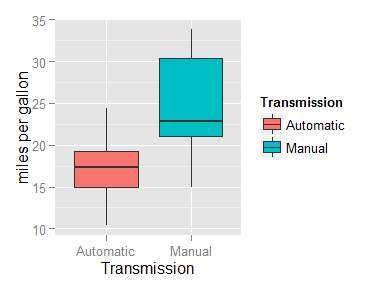

# Coursera Regression Course Project

## Project Summary
The dataset used for this project is `mtcars`, which is built in with R. It has 32 observations and 11 variables.

Scenario: Suppose you work for Motor Trend, a magazine about the automobile industry. Looking at a data set of a collection of cars, they are interested in exploring the relationship between a set of variables and miles per gallon (MPG) (outcome). They are particularly interested in the following two questions: 

- Is an automatic or manual transmission better for MPG?    
- Quantify the MPG difference between automatic and manual transmissions.

Excecute summary : After building a regression model from the dataset, we were able to conclude that cars that have manual transmissions will lead to a 2.9 increase in mpg ( miles/gallon ) when compared with cars with automatic transmissions.

### Question 1 : Is an automatic or manual transmission better for MPG

- In the `mtcars` dataset, the column am indicates whether the car is automatic or manual trasmission (0 = automatic, 1 = manual ). Some preprocessing is done to change the numbers to more descriptive.   
- we will first use a boxplot look at the differences of the mpg(miles/gallon) between the two transmissions.

```r
# load the required library
library(ggplot2)
suppressMessages(library(gridExtra))
# convert am column to factor and relabel them
mtcars$am <- factor( mtcars$am,levels = c( 0, 1 ), labels = c( "Automatic", "Manual") )
# plot the boxplot
ggplot( mtcars, aes( am, mpg, fill = am ) ) + geom_boxplot() +
    xlab("Transmission") + ylab("miles per gallon") + labs( fill = "Transmission" )
```

 

```r
# calculate the means of mpg for the two transmissions
means <- tapply( mtcars$mpg, mtcars$am, mean )
```
- **Note:** The boxplot depicts that cars which have manual transmissions seems to result in a higher mean for mpg than automatic ones ( manual: 24.3923077, automatic: 17.1473684 ), but we will confirm that with a two-sample t-test. 
- A test comparing the variances between the two is applied prior to conducting the t-test.

```r
var.test( mpg ~ am, data = mtcars, alternative = "two.sided" )$p.value
```

```
## [1] 0.06690592
```

- **Note:** From the fact that the p value of the F-test is larger than 0.05, we can infer that there is insufficient evidence that the variance differ. Now we do the t-test with the assumption that the variance are the same between the two measurements.  

```r
t.test( mpg ~ am, paired = FALSE, var.equal = TRUE, data = mtcars )
```

```
## 
## 	Two Sample t-test
## 
## data:  mpg by am
## t = -4.1061, df = 30, p-value = 0.000285
## alternative hypothesis: true difference in means is not equal to 0
## 95 percent confidence interval:
##  -10.84837  -3.64151
## sample estimates:
## mean in group Automatic    mean in group Manual 
##                17.14737                24.39231
```
- **Note:** Now, looking at the p-value of the two sample t test, we can conclude that the mean between the two is significantly different. Therefore, we can extrapolate that from this dataset, that manual transmission for cars leads to better values in mpg(milees/gallon).

### Question 2: Quantify the MPG difference between automatic and manual transmissions

- To begin with, let us built a regression model `model1` with only transmissions as the predictor and the mpg as the outcome.

```r
model1 <- lm( mpg ~ am, data = mtcars )
list( coefficient = summary(model1)$coef, rsquare = summary(model1)$r.squared )
```

```
## $coefficient
##              Estimate Std. Error   t value     Pr(>|t|)
## (Intercept) 17.147368   1.124603 15.247492 1.133983e-15
## amManual     7.244939   1.764422  4.106127 2.850207e-04
## 
## $rsquare
## [1] 0.3597989
```
- **Note1:** From this simple linear regression model, we can see that the p-value from the coefficient section is also lower than 0.05, which solidifies the fact that mpg values for manual transmission is about 7.2449393 higher than automatic transmissions.
- **Note2:** The r-square value for this model, 0.3597989, means that the total variability that is explained by only using am as the predictor is still quite low. Thus, we should try to include more variables to the model.

The whole process for coming up with the suitable value is ommitted in this report, to avoid making it too lengthy. Basically the idea is to first build to model with all the columns of the dataset as the predictor and mpg as the outcome. Then we will discard the predictors with p-value greater than 0.05 ( This process is done one by one, starting with the predictor that has the largest p-value ) until all p-value meet its criteria. The final model, `model2` is presented in the following.


```r
# convert columns into factors
cols <- which( names(mtcars) %in% c( "cyl", "vs", "gear", "carb" ) )
data <- modifyList( mtcars, lapply( mtcars[,cols], as.factor ) )
# final linear regression model
model2 <- lm( formula = mpg ~ wt + qsec + am, data = data )
summary(model2)
```

```
## 
## Call:
## lm(formula = mpg ~ wt + qsec + am, data = data)
## 
## Residuals:
##     Min      1Q  Median      3Q     Max 
## -3.4811 -1.5555 -0.7257  1.4110  4.6610 
## 
## Coefficients:
##             Estimate Std. Error t value Pr(>|t|)    
## (Intercept)   9.6178     6.9596   1.382 0.177915    
## wt           -3.9165     0.7112  -5.507 6.95e-06 ***
## qsec          1.2259     0.2887   4.247 0.000216 ***
## amManual      2.9358     1.4109   2.081 0.046716 *  
## ---
## Signif. codes:  0 '***' 0.001 '**' 0.01 '*' 0.05 '.' 0.1 ' ' 1
## 
## Residual standard error: 2.459 on 28 degrees of freedom
## Multiple R-squared:  0.8497,	Adjusted R-squared:  0.8336 
## F-statistic: 52.75 on 3 and 28 DF,  p-value: 1.21e-11
```

#### **Conclusion:**
Based on the summary of this model, we can conclude that: 

- Cars with manual transmission accounts for 2.9 more mpg compared to cars with automatic transmission, this value quite is different from `model1` when we only used transmission type as the predictor.
- For every increase in wt( 1000 pounds ) it will cause mpg to decrease about 3.9 ( miles/gallon ).
- mpg increases slightly by 1.2 with every unit increase in qsec( 1/4 mile time ).
- This model explains approximately 84 percent of the total variability.

### Appendix
The appendix contains two plots:

- Plot of the predicted value of mpg using the model and actual value.
- Plot the predicted values and its corresponding residuals.

```r
# predict vs actual value plot
data1 <- data.frame( actual = mtcars$mpg, predicted = model2$fitted.values )
pred  <- ggplot( data1, aes( predicted, actual ) ) + geom_point( size = 3 ) +
             geom_smooth( method = "lm" ) +
             ggtitle("Predicted mpg v.s. Actual mpg")
# residual plot
data2 <- data.frame( residuals = model2$residuals, predicted = model2$fitted.values )
resid <- ggplot( data2, aes( predicted, residuals ) ) + geom_point( size = 3 ) +
             ggtitle("Residuals of the Predicted Value") + 
             geom_hline( yintercept = 0, color = "blue", size = 1 )
# Plot the stored graphs
grid.arrange( pred, resid, ncol = 2 )
```

 

- **Note1:** For the plot on the left, if the model is considered to a good estimate of the outcome, there should be strong correlation between the model’s predictions and its actual results.
- **Note2:** Ideally your plot of the residuals should be symmetrically distributed around the lower single digits of the y-axis, and there are no clear patterns what so ever.


