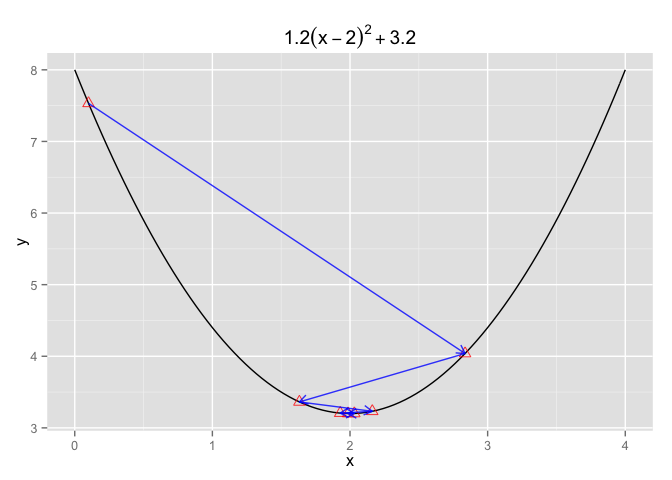
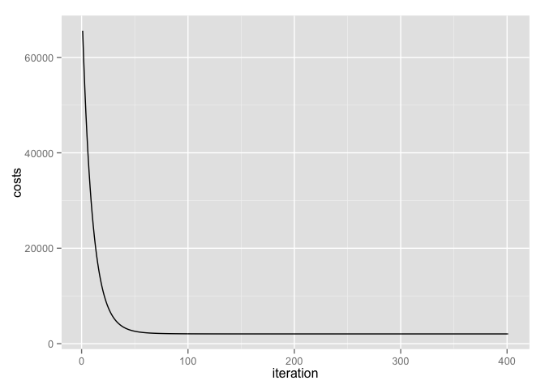

# Gradient Descent with Linear Regression
Ming-Yu Liu  
October 30, 2015  

> To all of the machine-learning experts out there, I'm sure people who are not in the statistics, math or computer science department will be very grateful if you could provide simple code examples to go along with mathematical notations.

The following tutorial assumes you know the basics of R programming, e.g. data structure such as list and data.frame, looping, visualization using ggplot2 etc. So we will not go over line by line of the code, but will split the code into moderate size chunks and specify what that code chunk is doing.

## Background Information

For supervised learning problems like linear regression, the way it works is when given some set of numbers input variable, we wish to predict another set of numbers. For instance given the number of bedrooms and the size of the house, we wish to predict the price in which the house will be sold. So what we want to know, is how much do "variables" such as the number of bedrooms or the size of the house affects the house's price. One easy approach to calculate these "variables" is by gradient descent.

## Getting Started With Gradient Descent 

Let's start from a basic formula $1.2\times(x-2)^2 + 3.2$. If you still remember basic calculus, the first derivative of function gives you the optimal solution to that funciton. In this case, it's by solving $2\times1.2\times(x-2)=0$.


```r
# libraries that we'll use throughout the tutorial
library(grid)
library(dplyr)
library(scales)
library(ggplot2)

# original formula 
Formula <- function(x) 1.2 * (x-2)^2 + 3.2

# visualize the function, and the optimal solution
ggplot( data.frame( x = c( 0, 4 ) ), aes( x ) ) + 
stat_function( fun = Formula ) + 
geom_point( data = data.frame( x = 2, y = Formula(2) ), aes( x, y ), 
	        color = "blue", size = 3 ) + 
ggtitle( expression( 1.2 * (x-2)^2 + 3.2 ) )
```

 

By solving the first derivative of the function or simply eyeballing the graph, we can easily tell that the minimum value to the formula is when x equals 2. Plugging the value back into the formula gives us the solution 3.2. 

That was easy, however if the function starts to get really complicated then solving this won't be this simple. This is where "gradient descent" comes in, and the formula to this buzzword is listed below.

$$\text{Repeat until converge} \{ x:=x-\alpha\triangledown F(x) \}$$

- The notation := stands for overwriting the value on the left of := with values on the right of := .
- $\triangledown$ stands for taking the first derivative of the function.
- $\alpha$ stands for the learning rate which is set manually.

Let's break that down piece by piece. Putting the formula in plain English: Imagine gradient descent as when you're at the top of a mountain and you want to get down to the very bottom, you have to choose two things. First the direction you wish to descend and second the size of the steps you wish to take. After choosing both of these things, you will keep on taking that step size and that direction until you reach the bottom. Now back to the formula. $\alpha$ corresponds to the size of the steps you wish to take and $\triangledown F(x)$ gives you the direction that you should take for your given formula. The following code, is a small example starting with one iteration of the process. Note that in order for the formula to start calculating you will have to assign an initial value for x.


```r
# first derivative of the formula above
Derivative <- function(x) 2 * 1.2 * (x-2) 

# define the alpha value (learning rate)
learning_rate <- .6

# define the initial value 
x <- .1

( iteration <- data.frame( x = x, value = Formula(x) ) )
```

```
##     x value
## 1 0.1 7.532
```

Here, we defined the learning rate to be 0.6 for our algorithm and the initial value of x equals 0.1 leads to the value 7.532, which is still far off from the optimal solution 3.2. Let's use these user-defined initial value and learning rate on our gradient descent algorithm.


```r
#### One iteration :
# apply the formula of gradient descent
x <- x- learning_rate * Derivative(x)

# output
rbind( iteration, c( x, Formula(x) ) )
```

```
##       x    value
## 1 0.100 7.532000
## 2 2.836 4.038675
```

Row one of the output denotes the intial x and the formula's value when plugging in x, and the second row denotes the value after the first iteraion. We can see that the gradient descent algorithm starts tuning x with the goal of finding smaller value for formula. 

Hopefully, after that one iteration example, everything is a now bit more clear. Before we apply the whole algorithm, I still owe you the definition of "repeat until converge" from the algorithm. 

There usually two ways of applying the notion "repeat until converge" into code. One : Keep updating the x value until the difference between this iteration and the last one, is smaller than epsilon (we use epsilon to denote a user-defined small value). Two : The process of updating the x value surpass a user-define iteration. Often times, you can use both in your first trial, since you probably have no idea when will the algorithm converge, and this is what you'll be seeing in the following code.

Now we're ready to apply the whole thing. 


```r
#### Gradient Descent implementation :

## Define parameters :
# x_new : initial guess for the x value
# x_old : assign a random value to start the first iteration 
x_new <- .1 
x_old <- 0

# define the alpha value (learning rate)
learning_rate <- .6

# define the epilson value, maximum iteration allowed 
epsilon <- .05
step <- 1
iteration <- 10

# records the x and y value for visualization ; add the inital guess 
xtrace <- list() ; ytrace <- list()
xtrace[[1]] <- x_new ; ytrace[[1]] <- Formula(x_new)
cbind( xtrace, ytrace )
```

```
##      xtrace ytrace
## [1,] 0.1    7.532
```

Elaboration on what i defined :

- `x_old` and `x_new` to calculate the difference of the x value between two iterations, the two numbers are different so that the loop can still work for the first iteration of the while loop, as you'll see later.
- `epsilon` If the difference between `x_old` and `x_new` is smaller than this value then the algorithm will halt.
- `iteration` The maximum iteration to train the algorithm. That is, if the difference of the x value on the 10th iteration and 10 still larger than the `epsilon` value, the algorithm will still halt.
- `xtrace` and `ytrace` stores the x and its corresponding formula value for each iteration. It's good to store these values to get a sense of how fast the algorithm converges.


```r
while( abs( x_new - x_old ) > epsilon & step <= iteration )
{
	# update iteration count 
	step <- step + 1	
	
	# gradient descent
	x_old <- x_new
	x_new <- x_old - learning_rate * Derivative(x_old)
	
	# record keeping 
	xtrace[[step]] <- x_new
	ytrace[[step]] <- Formula(x_new)	
}

# create the data points' dataframe
record <- data.frame( x = do.call( rbind, xtrace ), y = do.call( rbind, ytrace ) )
record
```

```
##          x        y
## 1 0.100000 7.532000
## 2 2.836000 4.038675
## 3 1.632160 3.362368
## 4 2.161850 3.231434
## 5 1.928786 3.206086
## 6 2.031334 3.201178
## 7 1.986213 3.200228
```

From the output above, we can see that the algorithm converges at iteration 7 before the user-specified maximum iteration, with the x and formula value that's close to the original optimal value. Let's create the visualization for the process.


```r
# create the segment between each points (gradient steps)
segment <- data.frame( x = double(), y = double(), xend = double(), yend = double() )
for( i in 1:( nrow(record)-1 ) )
{
	segment[ i, ] <- cbind( record[ i, ], record[ i+1, ] )	
}

# visualize the gradient descent's value 
ggplot( data.frame( x = c( 0, 4 ) ), aes( x ) ) + 
stat_function( fun = Formula ) + 
ggtitle( expression( 1.2 * (x-2)^2 + 3.2 ) ) + 
geom_point( data = record, aes( x, y ), color = "red", size = 3, alpha = .8, shape = 2 ) +
geom_segment( data = segment , aes( x = x, y = y, xend = xend, yend = yend ), 
              color = "blue", alpha = .8, arrow = arrow( length = unit( 0.25, "cm" ) ) )
```

 

The visualization gives us a clearer picture that after assigning an inital value of x and parameters such as `epsilon`, `learning_rate`, `iteration`, the gradient descent algorithm will start manipulate the x value until it meets the converge criteria, and an interesting feature is that when the algorithms starts to get closer and closer to the optimal value, it will take smaller "steps " and wander nearby before converging.

Some takeways for this section :

1. The paramters' value you choose will most likely affect your result. Especially for `learning_rate`, for this parameter, if you chosen a value that is too big, the algorithm may skip the optimal value and if you chosen a value that is too small, then the algorithm may take too long to converge. You can try it out yourself ~ .
2. The formula $1.2\times(x-2)^2 + 3.2$ is the "cost function" for this problem, that is we plug in value x into this function to determine whether or not we can reached the optimum. We'll be using this name in the following tutorial, so make sure you have it in your mind.

## Applying it to Linear Regression

Now all of that was just preamble, to get ourselves familiar with gradient descent, it's now time to apply the same concept to linear regression. We'll use the a simple housing data to illustrate the idea. The [link](https://github.com/ethen8181/machine-learning/blob/master/linear%20regression/housing.txt) to the dataset.


```r
housing <- read.table( "housing.txt", header = TRUE, sep = "," )
list( head(housing), dim(housing) )
```

```
## [[1]]
##   area bedrooms  price
## 1 2104        3 399900
## 2 1600        3 329900
## 3 2400        3 369000
## 4 1416        2 232000
## 5 3000        4 539900
## 6 1985        4 299900
## 
## [[2]]
## [1] 47  3
```

This is a dataset that contains 3 columns (or so called variables) including the number of bedrooms, the area (size) of the house, and 47 rows. For this example, what linear regression will try to do is to train a model using this dataset and in the future after only obtaining the area and bedroom number we want to be able to predict the prices of other houses. So how can we use gradient descent to formulate this linear regression model? Recall that the algorithm's formula is :

$$\text{Repeat until converge} \{ x:=x-\alpha\triangledown F(x) \}$$

Now all we have to do is to define the appropriate cost function of the linear regression and plug it back in to formula above! Before we give it to you, we'll first denote some simple math notations.

- m : the number of training examples. Here we will use all 47 rows.
- n : the number of "input" variables, in this case, it is 2, the number of bedrooms and the area (size) of the house.
- $x^{(i)}$ : the ith row of the "input" variable in the dataset. This does not denote x raised to the power of i!
- $y^{(i)}$ : the ith row "output" variables. In this case the output variable is the price of the house.
- Formula for linear regression :

$$ h_{\theta}(x) = \theta_{0} + \theta_{1}x_{1} + \theta_{2}x_{2} + \dotsm + \theta_{n}x_{n}  $$

Here the $\theta_{j}$s (j going from 0 to n) denotes the weights or so called coeffficients of the model. Here we only have 2 variables, so j only goes up to 2, and the $h_{\theta}(x)$ for this dataset would be $\theta_{0} + \theta_{1}x_{area} + \theta_{2}x_{bedrooms}$. And for conciseness, suppose we define $x_{0}$ to be a vector of all 1s (This is a trick is used in the gradient descent function!!). In that case the formula can be rewritten as :

$$ h_{\theta}(x) = \sum_{j=0}^n \theta_{j}x_{j} $$

So for linear regression, these parameters $\theta_{j}$s from the formula above are what we want find out or train. So given a training dataset, how do we learn them? One reasonable method is to make the value produced by function F(x) to be as close to the original $y^{(i)}$ as possible (at least for the training dataset we now have). That is after plugging in the combinations of the number of bedrooms and the area size of the house into the function, we want the house price calculated by the function to be as close to the original value of the house price as possible (for every row of dataset). This gives us the cost function $F(\theta)$ below.

$$ F(\theta) = \frac{1}{2} \sum_{i=1}^m ( h_{\theta}(x^{(i)}) - y^{(i)} )^2 $$

The $\frac{1}{2}$ is there to minimize the math loading for later when we take the first derivative of the function. Again, the meaning for the formula above means after plugging in our input variables $x^{(i)}$ (recall that i denotes the ith row in the dataset) into the function and obtaining the value, which is the $h_{\theta}(x^{(i)})$ part. We will calculate its distance with the original $y^{(i)}$. Therefore the process of the gradient descent is to start some value for $\theta$ and keep updating it to reduce $F_{\theta}$, with the goal of minimizing the summed up differences for all rows. This summed of difference is often referred to as the sum squared error. 

Next, we'll state without proving that after taking the first derivative of the function $F_{\theta}$ and putting it back inside the gradient descent algorithm we'll obtain the formula below (Please refer to the reference if you're interested in the proof):

$$ \theta_{j} := \theta_{j} - \alpha \frac{1}{m} \sum_{i=1}^m ( h_{\theta}(x^{(i)}) - y^{(i)} ) x_{j}^{(i)} $$

Now all that formula may look a might formidable. The notion is, after you have calculated difference (error) between $h_{\theta}(x^{(i)}) - y^{(i)}$ for each row i you multiply that difference to all of the $x_{j}$s for each row and sum them up. A small example using two rows :


```r
# suppose you've already calculated that the difference of 
# the two rows are 100 and 200 respectively, then 
# using the first two rows of the input variables
housing[ c( 1, 2 ), -3 ]
```

```
##   area bedrooms
## 1 2104        3
## 2 1600        3
```

```r
# multiply 100 with row 1 
( row1 <- 100 * housing[ 1, -3 ] )
```

```
##     area bedrooms
## 1 210400      300
```

```r
# multuply 200 with row 2
( row2 <- 200 * housing[ 1, -3 ] )
```

```
##     area bedrooms
## 1 420800      600
```

```r
# sum each row up
list( area = sum( row1[1] + row2[1] ), bedrooms = sum( row1[2] + row2[2] ) )
```

```
## $area
## [1] 631200
## 
## $bedrooms
## [1] 900
```

These value will be the results you obtain for the $\sum_{i=1}^m ( h_{\theta}(x^{(i)}) - y^{(i)} ) x_{j}^{(i)}$ part with m equals 2. Hopefully that part is now clear !

Another important concept before getting to the code for gradient descent with linear regression. The tricky thing about this approach is that often times it requires normalization or so called feature scaling, or else the algorithm will most likely leads to really bad results. Take our example housing dataset for example. 


```r
head(housing)
```

```
##   area bedrooms  price
## 1 2104        3 399900
## 2 1600        3 329900
## 3 2400        3 369000
## 4 1416        2 232000
## 5 3000        4 539900
## 6 1985        4 299900
```

You'll notice that houses' area (sizes) are approximately 1000 times larger than bedroom counts. Therefore when input variables differ by orders of magnitudes, performing some kind of normalization is often times required. Here we'll apply the widely used z-score normalization, where given a input variable (column) you subtract every row element with its mean and then divide it by its standard deviation (see code below). 


```r
# z-score normalization
# this is equivalent to the "scale" function built in with R
Normalize <- function(x) ( x - mean(x) ) / sd(x)
```

Just want to mention, after the z-score normalization, 0 means that the original number is the average for that column, and all other normalized-number means how many standard deviations is the number away from the mean.

- **Note** : Keep in mind that when performing the normalization you should also store the values that was used the scale each of the feature. Because after we're done learning the parameters of the model, next time when we're given a new house information containing only the bedroom number and house size we will like to predict its house price. And before directly plugging in the numbers to the model, we will also have to normalize them.

Now the `GradientDescent` function for linear regression. Parameters for the function :

- `data` The whole data frame type data.   
- `target` Takes a character stating column name that serves as the output variable.  
- `learning_rate` Learning rate for the gradient descent algorithm. 
- `iteration` Halting criterion : maximum iteration allowed for training the gradient descent algorithm.
- `epsilon` Halting criterion : If the trained parameter's difference between the two iteration is smaller than this value then the algorithm will halt. Default to 0.001.
- `normalize` Boolean value indicating whether to performing z-score normalization for the input variables. Default to true.
- `method` Specify either "batch" or "stochastic" for the gradient descent method. Use batch for now, this will be explained later!! 
- The function returns a list consisting of : 
    - Data frame that records the theta value (model's parameter) for each iteration.
    - Data frame that records the cost value for each iteration.
    - Data frame that stores the noramalized mean and standard deviation for each input column.


```r
# source in the function to concise the documentation
source("linear_regession_1_code/gradient_descent.R")

# parameters :
# learning rate of 0.05, 500 iteration, method = "batch"
trace_b <- GradientDescent( target = "price", data = housing, 
	                        learning_rate = 0.05, iteration = 500, method = "batch" )
# print out the final parameters
parameters_b <- trace_b$theta[ nrow(trace_b$theta), ]
parameters_b
```

```
##       theta0   area  bedrooms
## 501 340412.7 110630 -6648.375
```

We've now obtain the parameters of the linear model calculated by the gradient descent method. Let's use it and compare with R's built-in `lm` function, which also calculates the linear regression's parameters.


```r
# linear regression 
normed <- apply( housing[ , -3 ], 2, Normalize )
normed_data <- data.frame( cbind( normed, price = housing$price ) )
model <- lm( price ~ ., data = normed_data )
model
```

```
## 
## Call:
## lm(formula = price ~ ., data = normed_data)
## 
## Coefficients:
## (Intercept)         area     bedrooms  
##      340413       110631        -6649
```

From the result above, after setting the learning rate to be 0.05 and training our gradient descent algorithm for 500 iterations, the parameters are really close to the results given by the linear regression function in R. So in this case the linear regression model obtained by our gradient descent algorithm is : 

$$ h_{\theta}(x) = 340,413 + 110,630x_{area} + -6648x_{bedroom} $$

Now that we've gotten ourselves a bit famliar with gradient descent. I still own you an explanation about the `method` parameter from the gradient descent function call above. Let's recall the math formula for this approach : 
$$ \theta_{j} := \theta_{j} - \alpha \frac{1}{m} \sum_{i=1}^m ( h_{\theta}(x^{(i)}) - y^{(i)} ) x_{j}^{(i)} $$

First the more formal name to this approach is **batch gradient descent**. From the formula, the part $\sum_{i=1}^m$ tells you that this method looks at every example in the entire training set on every step of the update. Normally, however, the size of our training data is usually very large; For the example dataset we used in this document m was only 47 this approach will work out fine, but if we were to use this approach on a large training dataset, updating the parameters for each iteration will take us linear time, \mathcal{O}(m), because this method has to scan through the entire training set before taking a single step. An alternative approach to this is the **stochastic gradient descent**, math formula as follow :

$$ \text{for } i \text{ in } 1, 2, \dotsm, m :  $$
$$ \theta_{j} := \theta_{j} - \alpha ( h_{\theta}(x^{(i)}) - y^{(i)} ) x_{j}^{(i)} $$

The notion for stochastic gradient descent is, for each iteration, we will update the parameters according to the error of a single training example only, I repeat a single. Then for the next iteration, it will use the next training example, and so on. As for the for loop, the order of which training example of use can also be selected randomly. The trade off for this method is that, since it's computing the value to "descent" using only a single training example, the final parameters it obtain will oscillating around the optimal value, but never actually reaches it; though in practice most of the values near the minimum will be reasonably good approximations to the true minimum.

In sum, compared to batch gradient descent, this method is more widely used for LARGE training datasets, as it converges faster.

## Conclusions

Some takeways about gradient descent : 

1. We can visualize the costs obtained from each iteration.


```r
costs_df <- data.frame( iteration = 1:nrow(trace_b$cost), 
	                    costs = trace_b$cost / 1e+8 )

ggplot( costs_df, aes( iteration, costs ) ) + geom_line()
```

 

As you can see from the plot, at the beginning when we randomly assign the theta value to our model, the magnitudes of the update is huge. But as it approaches the optimum, then the algorithm will find little need to update the parameters, and therefore, the value of the cost does not change much. This matches the behavior it had with our simple equation example in the Getting Started with Gradient Descent section.

2. Note that gradient descent does not equal to linear regression, there're other approaches to solve or obtain the model's parameters, however, this algorithm, with a little tuning, is still widely used in many other places, such as artifical neural network.

3. If your input variables or features comes in different magnitudes, then normalizing them is an important preprocessing step before applying gradient descent. Or else the results will most likely be heavily affected by the input variables with the larger magnitudes, and in that case the algorithm might either returns a really bad result or worse, will not even work.

4. Tuning parameters including the learning rate, epsilon and iterations will surely affect the result and the speed to converge, and this requires some trial and error. 

All the code for this documentation can be found [here](https://github.com/ethen8181/machine-learning/blob/master/linear%20regression/linear_regession_1_code). The gradient descent function and the documentation code are in two separate scripts.

Any comments or suggestions is appreciated. That includes bugs or typos report. You can file these new issues [here](https://github.com/ethen8181/machine-learning/issues). 

## References

1. Gradient Descent Example: http://www.r-bloggers.com/gradient-descent-in-r/
2. Linear Regression with Gradient Descent, Notations and Proofs: http://cs229.stanford.edu/notes/cs229-notes1.pdf

## R Session Information  


```r
sessionInfo()
```

```
## R version 3.2.2 (2015-08-14)
## Platform: x86_64-apple-darwin13.4.0 (64-bit)
## Running under: OS X 10.10.5 (Yosemite)
## 
## locale:
## [1] en_US.UTF-8/en_US.UTF-8/en_US.UTF-8/C/en_US.UTF-8/en_US.UTF-8
## 
## attached base packages:
## [1] grid      stats     graphics  grDevices utils     datasets  methods  
## [8] base     
## 
## other attached packages:
## [1] ggplot2_1.0.1 scales_0.3.0  dplyr_0.4.3  
## 
## loaded via a namespace (and not attached):
##  [1] Rcpp_0.12.1      knitr_1.11       magrittr_1.5     MASS_7.3-43     
##  [5] munsell_0.4.2    colorspace_1.2-6 R6_2.1.1         stringr_1.0.0   
##  [9] plyr_1.8.3       tools_3.2.2      parallel_3.2.2   gtable_0.1.2    
## [13] DBI_0.3.1        htmltools_0.2.6  yaml_2.1.13      lazyeval_0.1.10 
## [17] assertthat_0.1   digest_0.6.8     reshape2_1.4.1   formatR_1.2.1   
## [21] evaluate_0.8     rmarkdown_0.8    labeling_0.3     stringi_1.0-1   
## [25] proto_0.3-10
```
