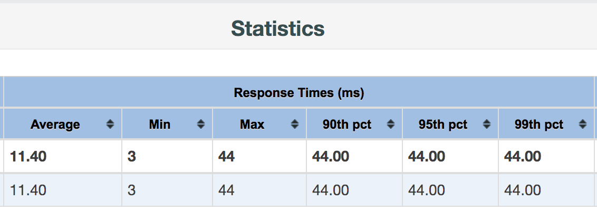

# FastAPI Machine Learning Model Service on Azure Kubernetes Cluster

In this repo, we'll be:

1. Training a machine learning model using LightGBM.
2. Writing a service using FastAPI for exposing the model through a service endpoint.
3. Packaging the service into a Docker container.
4. Deploying the Docker container to Azure Kubernetes Cluster to scale up the service.

It is recommended that the reader spend some time to understand some of the container terminologies such as images, nodes, pods, etc. There should be mainly tutorials online that explains docker and kubernetes at a high-level. e.g. [Youtube: Introduction to Microservices, Docker, and Kubernetes](https://www.youtube.com/watch?v=1xo-0gCVhTU) is an hour long video that introduces the background behind container-based technology.

## Model Training

The `tree_model_deployment.ipynb` trains a regression model using LightGBM and saves the model checkpoint under `app`. [[nbviewer](http://nbviewer.jupyter.org/github/ethen8181/machine-learning/blob/master/model_deployment/fastapi_kubernetes/tree_model_deployment.ipynb)][[html](http://ethen8181.github.io/machine-learning/model_deployment/fastapi_kubernetes/tree_model_deployment.html)]

## FastAPI Service

The `app` folder is where we'll store the service application, the model checkpoint, and the requirements.txt file that specifies the python dependencies for the application.

We'll use [FastAPI](https://fastapi.tiangolo.com/) to create the service. The library's main website contains thorough documentation and is pretty similar to Flask when it comes to specifying an endpoint.

For this service, we will have a `/predict` endpoint which accepts the features as the body, this service then returns the corresponding score.

## Docker Container

Follow the [Docker Installation Page](https://docs.docker.com/install/) to install Docker if folks haven't done so already.

```bash
# confirm the docker command line works
docker --version
```

The [Dockerfile](https://github.com/ethen8181/machine-learning/blob/master/model_deployment/fastapi_kubernetes/Dockerfile) creates the docker image for the application located under the `app` folder.

```bash
# build and tag a docker image, . parameter assumes the
# Dockerfile is within the same path. The built
# image resides within our local docker image registry
docker build --no-cache -t local_fastapi_model .

# run the container to ensure it works locally
docker run -p 80:80 local_fastapi_model
```

- We should see the message "Hello World" upon navigating to http://0.0.0.0:80
- Access the automatic documentation via the endpoint http://0.0.0.0:80/docs or http://0.0.0.0:80/redoc
- Test our model endpoint by using the following python script.

```python
import json
import requests

data = {
    'MedInc': 3.7917,
    'HouseAge': 40.0,
    'AveRooms': 4.959798994974874,
    'AveBedrms': 1.0301507537688441,
    'Population': 1039.0,
    'AveOccup': 2.6105527638190953,
    'Latitude': 38.24,
    'Longitude': -122.64
}

# change the url accordingly, here we're specifying the IP address along
# with the port number 80, which we configured to be the port that exposes the service
url = 'http://0.0.0.0:80/predict'
raw_response = requests.post(url, data=json.dumps(data))
raw_response.raise_for_status()
response = json.loads(raw_response.text)
response
# example output
#
# {'score': 2.2418686032176747}
```

Once we confirm that the docker image works locally, we can push the image to [docker hub](https://docs.docker.com/docker-hub/) for sharing.

```bash
docker login

# apart from the image name, it's generally a good practice to
# be explicit about the version number of the image
docker build --no-cache -t ethen8181/fastapi_model:0.0.1 .

docker push ethen8181/fastapi_model
```

## Azure Kubernetes Cluster

The [Azure documentation on Deploying an Azure Kubernetes Service](https://docs.microsoft.com/en-us/azure/aks/kubernetes-walkthrough) is pretty well written, this section is mainly following the instructions provided in that documentation.

We'll be mainly using the the command line here, to do so, we'll need to install:

- `az`. Azure command line tool for interacting with Azure. Follow the [Installing Azure Cli Documentation](https://docs.microsoft.com/en-us/cli/azure/install-azure-cli?view=azure-cli-latest)
- `kubectl` Kubernetes command line tool to run commands against Kubernetes cluster. Follow the [Install and Set Up Kubectl Documentation](https://kubernetes.io/docs/tasks/tools/install-kubectl/)

```bash
# showing the installation option on mac
brew install azure-cli

# we can check the version of the installed azure command line tool
az --version

# ditto for kubectl
brew install kubernetes-cli
kubectl version
```

This installs the command line tool for working with the Azure cloud computing resource, `az`. The first step is to login to Azure. Link to creating an [Azure account](https://azure.microsoft.com/en-us/free/) if folks haven't done so already.

```bash
az login
```

## Setting Up Azure Kubernetes Cluster

Listing down the concrete steps for deploying our applications to Azure Kubernetes Cluster.

1. **Create Resource Group.** This specifies where we want our resources to be stored. During this step, we specifiy the resource group's name and the location where the resource group's metadata will be stored.
2. **Create Azure Kubernetes Cluster.** This step actually creates the cluster, we associate the cluster with a resource group (the one we just created in step 1), specify the cluster name, how many node we would like in the cluster, and also enables the Azure Monitor container, which as its name suggests provides monitoring functionality for our cluster. Creating the cluster might take a few minutes. If we encounter a bad request error during this step, it is most likely due to [service principal](https://docs.microsoft.com/en-us/azure/aks/kubernetes-service-principal). Re-running the command for the second time usually works.
3. **Connecting to the Cluster.** To configure our credentials for the Kubernetes cluster we just created to our local `kubectl`. This command downloads credentials and configures the Kubernetes CLI to use them.

```bash
# step 1: create resource group
az group create --resource-group ethen8181-fastapi-model --location westus

# step 2: create azure kubernetes cluster, this step might take a while
az aks create \
    --resource-group ethen8181-fastapi-model \
    --name fastapi-model \
    --node-count 2 \
    --enable-addons monitoring \
    --generate-ssh-keys

# step 3: connecting to the cluster
az aks get-credentials --resource-group ethen8181-fastapi-model --name fastapi-model

# we can verify the connection to our cluster by returning the list of cluster nodes
# make sure the status shows ready
kubectl get nodes,pods

# or we can get a more detail information using describe
# a lot of times, the pods will show a status of pending,
# common issues with this is not enough cluster resource,
# or issue with the docker image
kubectl describe pods

# confirm our kubectl is pointed at the right context
kubectl config get-contexts

# example output
# 
# CURRENT   NAME                 CLUSTER          AUTHINFO                                
# *         fastapi-model        fastapi-model    clusterUser_ethen8181-fastapi-model_fastapi-model
```

## Deploying the Application

We've already did the work of creating the application, packaging it into a docker container, and pushing it to docker hub. What's left is to deploy the container to our Kubernetes cluster.

To create the application on Kubernetes, a.k.a deployment, we provide the information/configuration to `kubectl` in a .yaml file. The [deployment.yaml](https://github.com/ethen8181/machine-learning/blob/master/model_deployment/fastapi_kubernetes/deployment.yaml) and [service.yaml](https://github.com/ethen8181/machine-learning/blob/master/model_deployment/fastapi_kubernetes/service.yaml) contains a template configuration files showing how we can configure our deployment. Each section of the configuration file should be heavily commented.

- `apiVersion` Which version of the Kubernetes API we're using to create this object.
- `kind` What kind of object we're creating.
- `metadata` Data that helps uniquely identify the object, e.g. we can provide a name.
- `spec`: What state/characteristics we would like the object to have. The precise format of the object spec is different for every Kubernetes object.

```bash
kubectl apply -f deployment.yaml
kubectl apply -f service.yaml
# example output
#
# deployment.apps/fastapi-model-deployment created
# service/fastapi-model-service created
```

## Testing the Application

When we successfully deploy the applications, the Kubernetes service will expose the application to the internet via an external IP. We can using the `get service` command the retrieve this information.

```bash
kubectl get service fastapi-model-service --watch
# example output 
#
# NAME                    TYPE           CLUSTER-IP    EXTERNAL-IP     PORT(S)        AGE
# fastapi-model-service   LoadBalancer   10.0.71.181   13.91.195.109   80:31785/TCP   41s

# there're various other commands we can use to check the pods,nodes,services
# the common pattern for kubectl is the get command followed by the resource name.
# the -o wide, is one way of getting more details on the specified resource. If we wish
# the inspect the complete object, we can view the raw json or yaml using the -o json or
# -o yaml flag
kubectl get pods,svc -o wide
```

The `logs` command allows us to check the logs for our pods.

```bash
# or add the -f flag to continously stream logs
kubectl logs <pod-name>

# or execute commands iteractively on the container/pod itself 
kubectl exec -it <pod-name> bash
```

These are useful for one-off debugging, although it might be more useful to use a log aggregation service such as elasticsearch or cloud provider specific service. Log aggregation service provides more capabilities such as storing, filtering, searching, and aggregating logs from multiple pods into a single view.

We can now test the service we've created by specifying the correct url. We can use the same python script in the docker container section and swap the url.

```python
# change the url accordingly, here we're specifying the external IP address along
# with the port number 80, which we configured to be the port that exposes the service
url = 'http://13.91.195.109:80/predict'
```

Once we're done testing the service/cluster and the it is no longer needed, we should delete the resource group & cluster with the following command.

```bash
az group delete --resource-group ethen8181-fastapi-model --yes --no-wait
```

## Load Testing Application with Apache Jmeter

Upon developing our application, often times we would need to perform some load testing (a.k.a Load and Performance or LnP for short) to ensure our application meets the required SLA.

The following link provides a great introduction on how to do this with Apache Jmeter. [Blog: Rest API Load testing with Apache JMeter](https://medium.com/@chamikakasun/rest-api-load-testing-with-apache-jmeter-a4d25ea2b7b6)

Here we'll just be listing down the high level steps for reference purposes. Folks should walk through the the blog above if it's the first time using Apache Jmeter for a more in-depth walk through.

```bash
# upon downloading apache jmeter https://jmeter.apache.org/download_jmeter.cgi
# launch the GUI to set up the test plan
apache-jmeter-5.2.1/bin/jmeter.sh
```

For the test plan, we should be creating:

- Thread Group from Threads.
- HTTP Request from Sampler.
- HTTP Header Manager from Config Element.

Upon saving the test plan as a .jmx file. We should run the LnP via the command line as opposed to using the GUI (best practice suggested by Apache Jmeter).

```bash
cd jmeter

TEST_PLAN=fastapi_test_plan.jmx
JMETER_PATH=/Users/mingyuliu/apache-jmeter-5.2.1/bin/jmeter.sh
RESULT_FILE=fastapi_jmeter_results.jtl
REPORT_PATH=fastapi_jmeter_report
rm ${RESULT_FILE}
rm -r ${REPORT_PATH}

# run the LnP
# -n for non-gui
# -t points to our test plan
# -l location for the results file
${JMETER_PATH} -n -t ${TEST_PLAN} -l ${RESULT_FILE}

# generate a stats summary from the results file
# -g location for existing results file
# -o web report folder, provides a nicer visualization on top the report file
${JMETER_PATH} -g ${RESULT_FILE} -o ${REPORT_PATH}

# open the visualization
open ${REPORT_PATH}/index.html
```

The most important part of the report is the LnP summary statistics.




# Reference

- [Youtube: Introduction to Microservices, Docker, and Kubernetes](https://www.youtube.com/watch?v=1xo-0gCVhTU)
- [Azure Documentation: Quickstart - Deploy an Azure Kubernetes Service cluster using the Azure CLI](https://docs.microsoft.com/en-us/azure/aks/kubernetes-walkthrough)
- [Kubernetes Documentation: Get started with Kubernetes (using Python)](https://kubernetes.io/blog/2019/07/23/get-started-with-kubernetes-using-python/)
- [Kubernetes Documentation: Learn Kubernetes Basics](https://kubernetes.io/docs/tutorials/kubernetes-basics/)
- [Blog: A Simple Web App in Python, Flask, Docker, Kubernetes, Microsoft Azure, and GoDaddy](https://acaird.github.io/2019/02/11/docker-web-app-with-azure)
- [Blog: Introduction to YAML: Creating a Kubernetes deployment](https://www.mirantis.com/blog/introduction-to-yaml-creating-a-kubernetes-deployment/)
- [Blog: Porting Flask to FastAPI for ML Model Serving](https://www.pluralsight.com/tech-blog/porting-flask-to-fastapi-for-ml-model-serving/)
- [Blog: Getting started with Azure Kubernetes Service (AKS)](https://blog.rafay.co/getting-started-with-azure-kubernetes-service-aks)
- [Blog: Set up Kubernetes on Azure](https://mikebridge.github.io/post/python-flask-kubernetes-4/)
- [Blog: Rest API Load testing with Apache JMeter](https://medium.com/@chamikakasun/rest-api-load-testing-with-apache-jmeter-a4d25ea2b7b6)